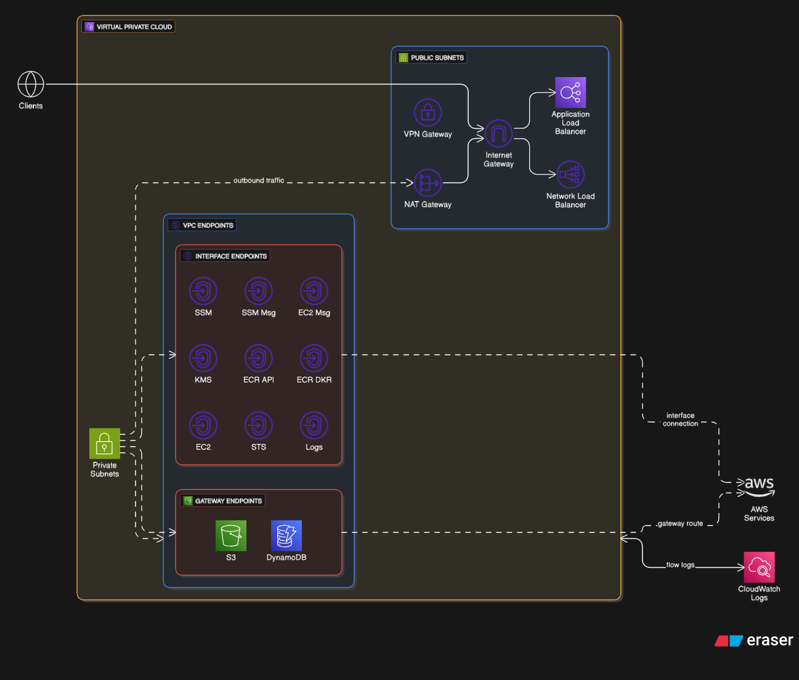

# oc-terraform-module-networking

A comprehensive Terraform module for setting up AWS networking infrastructure required for EKS clusters. This module provides a one-stop solution for VPC, subnets, NAT gateways, security groups, VPC endpoints, and optional Network/Application Load Balancer configuration.

<p align="center">
  
  <h4 align="center">Module Architecture - Networking</h4>
</p>

## Features

- 🌐 **Complete VPC Setup** - VPC with configurable CIDR blocks and DNS settings
- 🏢 **Multi-AZ Architecture** - High availability across multiple availability zones
- 🔒 **Private & Public Subnets** - Auto-calculated subnet CIDRs with proper EKS tagging
- 🚀 **NAT Gateway** - HA or single NAT gateway options for cost optimization
- 🔐 **Security Groups** - Pre-configured for EKS nodes, control plane, and VPC endpoints
- 🔌 **VPC Endpoints** - Interface and gateway endpoints for AWS services (SSM, KMS, ECR, S3, etc.)
- ⚖️ **Network Load Balancer** - Optional NLB for external access
- ⚖️ **Application Load Balancer** - Optional ALB with HTTP/HTTPS support
- 🕸️ **Service Mesh Ready** - Optional Istio security group configuration
- 📊 **VPC Flow Logs** - Optional CloudWatch logging for network traffic analysis
- 🏷️ **EKS Auto-Discovery** - Proper subnet tagging for automatic EKS integration

## Architecture

This module implements the following AWS networking architecture:

- **VPC** with configurable CIDR (default: `10.0.0.0/16`)
- **Public Subnets** across multiple AZs for NAT gateways and load balancers
- **Private Subnets** across multiple AZs for EKS nodes and pods
- **Internet Gateway** for public subnet internet access
- **NAT Gateways** for private subnet outbound internet access
- **VPC Endpoints** to reduce NAT costs and improve security
- **Security Groups** for nodes, control plane, and VPC endpoints
- **Optional Network Load Balancer** for TCP 443 traffic
- **Optional Application Load Balancer** for HTTP/HTTPS traffic


## Inputs

| Name | Description | Type | Default | Required |
| :--- | :--- | :--- | :--- | :--- |
| `bu_id` | Business Unit | `string` | `null` | **yes** |
| `app_id` | Application Unit | `string` | `null` | **yes** |
| `env` | Environment name (dev, staging, prod) | `string` | n/a | **yes** |
| `vpc_cidr` | CIDR block for VPC | `string` | `"10.0.0.0/16"` | no |
| `azs` | Availability zones | `list(string)` | `[]` | no |
| `private_subnets` | Private subnet CIDRs | `list(string)` | `[]` | no |
| `public_subnets` | Public subnet CIDRs | `list(string)` | `[]` | no |
| `enable_nat_gateway` | Enable NAT Gateway | `bool` | `true` | no |
| `single_nat_gateway` | Use single NAT Gateway | `bool` | `false` | no |
| `enable_dns_hostnames` | Enable DNS hostnames | `bool` | `true` | no |
| `enable_dns_support` | Enable DNS support | `bool` | `true` | no |
| `enable_vpn_gateway` | Enable VPN Gateway | `bool` | `false` | no |
| `enable_flow_logs` | Enable VPC Flow Logs | `bool` | `false` | no |
| `flow_logs_retention_days` | Flow logs retention days | `number` | `7` | no |
| `enable_vpc_endpoints` | Enable VPC endpoints | `bool` | `true` | no |
| `vpc_endpoints` | VPC endpoints map | `map(bool)` | `{...}` | no |
| `enable_network_load_balancer` | Enable NLB | `bool` | `false` | no |
| `nlb_subnet_ids` | NLB subnet IDs | `list(string)` | `[]` | no |
| `nlb_deletion_protection` | NLB deletion protection | `bool` | `true` | no |
| `nlb_access_logs_bucket_name` | NLB logs bucket | `string` | `null` | no |
| `nlb_access_logs_prefix` | NLB logs prefix | `string` | `null` | no |
| `enable_alb` | Enable ALB | `bool` | `false` | no |
| `alb_subnet_ids` | ALB subnet IDs | `list(string)` | `[]` | no |
| `alb_deletion_protection` | ALB deletion protection | `bool` | `true` | no |
| `alb_access_logs_bucket_name` | ALB logs bucket | `string` | `null` | no |
| `alb_access_logs_prefix` | ALB logs prefix | `string` | `null` | no |
| `alb_http_enabled` | Enable ALB HTTP | `bool` | `true` | no |
| `alb_https_enabled` | Enable ALB HTTPS | `bool` | `true` | no |
| `alb_certificate_arn` | ALB Certificate ARN | `string` | `null` | no |
| `alb_ingress_cidr_blocks` | ALB Ingress CIDRs | `list(string)` | `["0.0.0.0/0"]` | no |
| `enable_istio_support` | Enable Istio support | `bool` | `false` | no |
| `tags` | Additional tags | `map(string)` | `{}` | no |

## Outputs

| Name | Description |
| :--- | :--- |
| `vpc_id` | VPC ID |
| `vpc_cidr` | VPC CIDR block |
| `vpc_arn` | ARN of the VPC |
| `vpc_tags` | Tags applied to the VPC |
| `private_subnet_ids` | List of private subnet IDs |
| `public_subnet_ids` | List of public subnet IDs |
| `all_subnet_ids` | Combined list of all subnet IDs |
| `private_subnet_cidrs` | List of private subnet CIDR blocks |
| `public_subnet_cidrs` | List of public subnet CIDR blocks |
| `nat_gateway_ids` | NAT Gateway IDs |
| `nat_gateway_public_ips` | Elastic IPs of NAT Gateways |
| `azs` | Availability zones used |
| `node_security_group_id` | Security group ID for EKS nodes |
| `control_plane_security_group_id` | Security group ID for EKS control plane |
| `vpc_endpoint_security_group_id` | Security group ID for VPC endpoints |
| `istio_security_group_id` | Security group ID for Istio service mesh |
| `vpc_default_security_group_id` | Default VPC security group ID |
| `vpc_endpoints` | Map of VPC endpoint IDs |
| `vpc_endpoint_interface_dns_entries` | DNS entries for interface VPC endpoints |
| `nlb_arn` | Network Load Balancer ARN |
| `nlb_dns_name` | Network Load Balancer DNS name |
| `nlb_zone_id` | Network Load Balancer hosted zone ID |
| `nlb_target_group_arn` | NLB target group ARN |
| `alb_arn` | Application Load Balancer ARN |
| `alb_dns_name` | Application Load Balancer DNS name |
| `alb_zone_id` | Application Load Balancer hosted zone ID |
| `alb_security_group_id` | Security group ID for ALB |


## Usage

### Comprehensive Example with All Parameters

```hcl
module "networking" {
  source = "github.com/orbitcluster/oc-terraform-module-networking"

  # ===================================
  # Required Parameters
  # ===================================

  # Business Unit ID
  bu_id = "marketing"

  # Application ID
  app_id = "ecommerce"

  # Environment: dev, staging, or prod
  env = "prod"

  # ===================================
  # VPC Configuration (Optional)
  # ===================================

  # VPC CIDR block (default: "10.0.0.0/16")
  vpc_cidr = "10.0.0.0/16"

  # Availability zones (default: auto-detect 2-3 AZs in region)
  azs = ["us-east-1a", "us-east-1b", "us-east-1c"]

  # Private subnet CIDRs (default: auto-calculated from vpc_cidr)
  # These subnets will host EKS worker nodes and pods
  private_subnets = ["10.0.0.0/19", "10.0.32.0/19", "10.0.64.0/19"]

  # Public subnet CIDRs (default: auto-calculated from vpc_cidr)
  # These subnets will host NAT gateways and load balancers
  public_subnets = ["10.0.96.0/24", "10.0.97.0/24", "10.0.98.0/24"]

  # Enable DNS hostnames in VPC (default: true)
  enable_dns_hostnames = true

  # Enable DNS support in VPC (default: true)
  enable_dns_support = true

  # Enable VPN Gateway (default: false)
  enable_vpn_gateway = false

  # ===================================
  # NAT Gateway Configuration (Optional)
  # ===================================

  # Enable NAT Gateway for private subnet internet access (default: true)
  enable_nat_gateway = true

  # Use single NAT Gateway instead of one per AZ (default: false)
  # Set to true for cost savings in dev/test (~$32/mo vs ~$96/mo for 3 AZs)
  # Set to false for production HA
  single_nat_gateway = false

  # ===================================
  # VPC Endpoints Configuration (Optional)
  # ===================================

  # Enable VPC endpoints for AWS services (default: true)
  # Reduces NAT Gateway costs and improves security
  enable_vpc_endpoints = true

  # Individual VPC endpoint controls
  vpc_endpoints = {
    ssm         = true  # Systems Manager
    ssmmessages = true  # SSM Session Manager
    ec2messages = true  # SSM agent communication
    kms         = true  # Key Management Service
    ecr_api     = true  # ECR API (for pulling container images)
    ecr_dkr     = true  # ECR Docker registry
    ec2         = true  # EC2 API
    sts         = true  # Security Token Service
    logs        = true  # CloudWatch Logs
    s3          = true  # S3 Gateway endpoint
    dynamodb    = false # DynamoDB Gateway endpoint
  }

  # ===================================
  # Network Load Balancer (Optional)
  # ===================================

  # Create Network Load Balancer in public subnets (default: false)
  enable_network_load_balancer = true

  # Subnet IDs for NLB (default: uses public_subnets)
  # nlb_subnet_ids = ["subnet-xxx", "subnet-yyy"]

  # Enable deletion protection for NLB (default: true)
  nlb_deletion_protection = true

  # ===================================
  # Application Load Balancer (Optional)
  # ===================================

  # Create Application Load Balancer (default: false)
  enable_alb = true

  # Enable HTTP Listener (default: true)
  alb_http_enabled = true

  # Enable HTTPS Listener (default: true)
  alb_https_enabled = true

  # ACM Certificate ARN for HTTPS listener
  alb_certificate_arn = "arn:aws:acm:us-east-1:123456789012:certificate/..."

  # ===================================
  # Service Mesh Support (Optional)
  # ===================================

  # Configure security groups for Istio service mesh (default: false)
  # Adds ingress rules for Istio ports (15010-15012, 8080, 8443)
  enable_istio_support = true

  # ===================================
  # VPC Flow Logs (Optional)
  # ===================================

  # Enable VPC Flow Logs to CloudWatch (default: false)
  enable_flow_logs = true

  # CloudWatch log retention in days (default: 7)
  # Valid values: 1, 3, 5, 7, 14, 30, 60, 90, 120, 150, 180, 365, 400, 545, 731, etc.
  flow_logs_retention_days = 30
}
```

## Subnet CIDR Calculation

If you don't specify subnet CIDRs, they will be auto-calculated from the VPC CIDR:

**For VPC CIDR `10.0.0.0/16`:**
- Private Subnets (each /19, 8,192 IPs):
  - AZ 1: `10.0.0.0/19`
  - AZ 2: `10.0.32.0/19`
  - AZ 3: `10.0.64.0/19`
- Public Subnets (each /24, 256 IPs):
  - AZ 1: `10.0.96.0/24`
  - AZ 2: `10.0.97.0/24`
  - AZ 3: `10.0.98.0/24`

## Security Best Practices

1. **Use VPC Endpoints** - Reduce exposure to internet and lower NAT costs
2. **Enable Flow Logs** - Monitor network traffic for security analysis
3. **Private Subnets** - Run EKS nodes in private subnets only
4. **Security Groups** - Use provided security groups instead of wide-open rules
5. **Multi-AZ** - Deploy across multiple AZs for high availability

## License

This module is part of OrbitCluster and follows the project's licensing terms.
